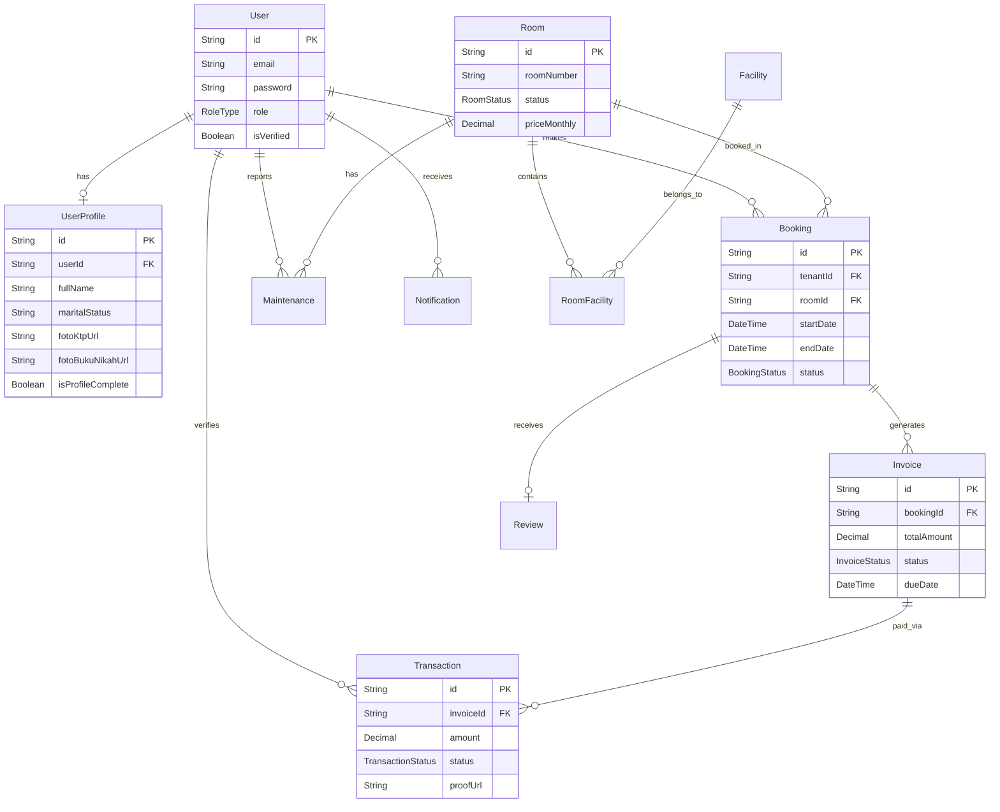
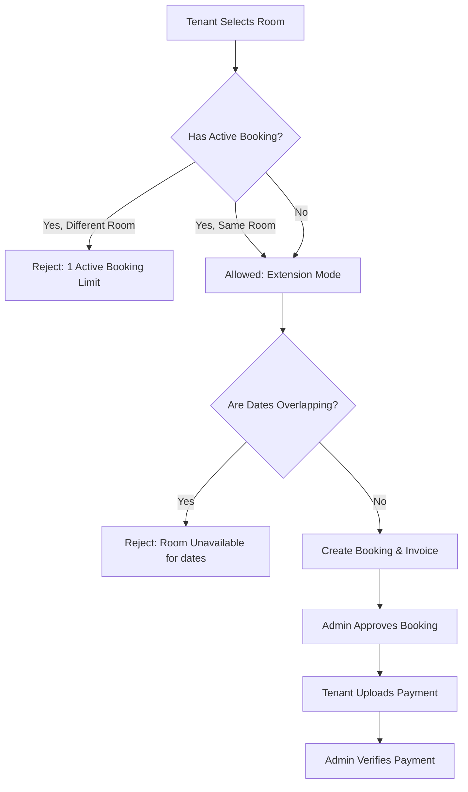
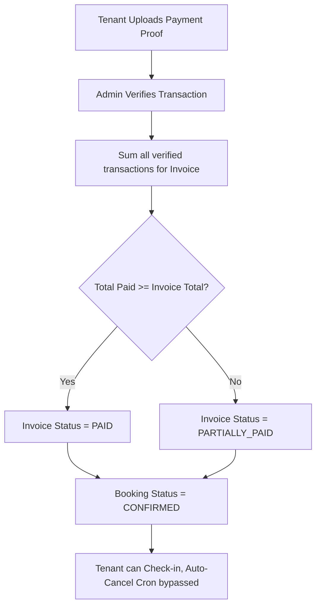

# Kost Management System Backend (Crack Project)

Comprehensive backend system for Kost (Boarding House) Management, built with NestJS, Prisma, and PostgreSQL.

## 🚀 Tech Stack & Deployment

- **Framework**: [NestJS](https://nestjs.com/) (Node.js)
- **Database**: [Neon](https://neon.tech/) (Serverless PostgreSQL)
- **ORM**: [Prisma](https://www.prisma.io/)
- **Storage**: [Cloudinary](https://cloudinary.com/) (For all image uploads: KTP, Marriage Certificates, Payment Proofs, Maintenance issues)
- **Deployment**: [Render](https://render.com/) (Backend Hosting)
- **Authentication**: JWT (Access & Refresh Tokens)

---

## 🏗 Architecture & Technical Setup

This project implements a robust layered architecture focusing on security, consistency, and maintainability.

### 1. Security Setup

- **JWT (JSON Web Tokens)**: Dual-token system. Short-lived Access Tokens (15m) and long-lived Refresh Tokens (7d) stored securely (hashed via Argon2 in DB).
- **Guards**: `AtGuard` (Validates Access Token), `RtGuard` (Validates Refresh Token), and `RolesGuard` (RBAC: 'admin' vs 'tenant').
- **CORS & Helmet**: Configured in `main.ts` to prevent XSS and restrict unauthorized cross-origin requests.

### 2. Enveloped Responses (Interceptors)

All API responses are formatted consistently using a global `TransformInterceptor`.
Format:

```json
{
  "status": 200,
  "message": "Success message",
  "data": { ... },
  "meta": { "totalItems": 10, "page": 1, "totalPages": 1 } // For pagination
}
```

### 3. Global Exception Filter

A custom `AllExceptionsFilter` catches all errors (HttpExceptions, Prisma Errors, Internal Server Errors) and formats them into the standard envelope format, preventing stack trace leaks to the client.

### 4. File Uploads (Cloudinary Integration)

Multer interceptors handle `multipart/form-data`. Instead of saving to disk, buffers are directly piped to `CloudinaryService` using `Promise.all` for batch uploads (e.g., Maintenance images) or single uploads (Payment Proofs, User Profiles).

### 5. Logger & Middleware

- **NestJS Logger**: Used across all services and cron jobs to track events and errors.
- **ValidationPipe**: Global pipe with `whitelist: true` and `transform: true` (implicit conversion enabled for query params).

---

## 📊 Database Entity Relationship Diagram (ERD)



---

## 🔄 Core Business Flows & Edge Cases

### 1. Booking & Indefinite Extension Flow



### 2. Partial Payment Logic



---

## 🛠 Services, DTOs & Edge Cases

### 1. Auth & Users Module

- **Services**: Handles registration, login, token refresh, and profile management.
- **Edge Cases**:
  - **Marital Status**: If a tenant sets `maritalStatus` to `married`, the system _strictly requires_ `fotoBukuNikahUrl`. If they try to update their profile to married without uploading the certificate, the request is rejected.
  - **Profile Completion**: `isProfileComplete` is dynamically calculated. It requires Full Name, WhatsApp, KTP, and (if married) Marriage Certificate.

### 2. Rooms Module

- **Services**: CRUD for Rooms and Facilities.
- **Edge Cases**:
  - `checkAvailability` does not outright reject if a room is `occupied`. It delegates the check to exact date overlapping. This is crucial for the **Indefinite Extension Workaround**, allowing tenants to re-book their currently occupied room for future months.

### 3. Bookings Module

- **Services**: Booking creation, approval, and automated Cron Jobs.
- **Edge Cases**:
  - **Indefinite Extension Workaround**: Tenants cannot book multiple rooms, but they _can_ create multiple bookings for the _same_ room as long as dates don't overlap. This generates a new independent Booking and Invoice for the extension period.
  - **Payment Reminders**: A Cron Job runs daily at 08:00 AM, scanning for `unpaid` or `partially_paid` invoices. It generates Notifications for tenants exactly on H-3 and H-1 before the due date.
  - **Auto-Cancel**: A separate Cron Job cancels `pending_payment` bookings if not paid within 24 hours.

### 4. Transactions & Invoices Module

- **Services**: Uploading payment proofs, verifying transactions.
- **Edge Cases**:
  - **Partial Payments**: Supported natively. If a tenant pays 1 month of a 2-month booking, the admin verifies the nominal amount. The invoice becomes `partially_paid`, but the Booking is set to `confirmed` so the tenant isn't evicted. The tenant can upload subsequent proofs to the same invoice until fully `paid`.
  - **Rejections**: If an Admin rejects a transaction, `rejectReason` is mandatory.

### 5. Maintenances & Reviews Module

- **Services**: Tenant complaints and room reviews.
- **Edge Cases**:
  - Maintenance allows batch image uploads (Cloudinary `Promise.all`).
  - Status flows strictly from `open` -> `in_progress` -> `resolved`.
  - Reviews can only be submitted if the Booking is `confirmed` or `completed`.

### 6. Dashboard Module

- **Services**: Aggregates data for the Tenant Home Screen.
- **Edge Cases**:
  - If a tenant has no active booking, returns a safe null object structure instead of 404.
  - Calculates `daysStayed` accurately based on `startDate`.
  - Returns an array of `recentTransactions` (last 5) instead of just one.
  - Generates virtual Calendar Events for upcoming Due Dates and H-3 reminders.

---

## 🗂 Directory Tree Structure

```text
src/
├── auth/                 # Authentication logic (JWT, Strategies, Guards)
├── common/               # Shared utilities
│   ├── decorators/       # Custom decorators (Roles, Public, GetCurrentUser)
│   ├── filters/          # Global exception filters
│   └── interceptors/     # Response transformation, timeouts
├── prisma/               # Database ORM connection and client
├── cloudinary/           # Cloudinary service integration
├── modules/              # Feature modules (Domain Driven Design)
│   ├── users/            # User profile, KYC uploads
│   ├── rooms/            # Room CRUD, pricing, availability check
│   ├── bookings/         # Reservation logic, checkout, cron jobs
│   ├── invoices/         # Billing details, remaining amount calculations
│   ├── transactions/     # Payment proofs, verification, partial payment
│   ├── maintenances/     # Complaint ticketing, issue tracking
│   ├── reviews/          # Ratings, RBAC fetching
│   ├── facilities/       # Room amenities management
│   ├── notifications/    # System alerts, payment reminders
│   └── dashboard/        # Aggregated data for frontend views
└── main.ts               # Application entry point
```

---

## 📚 API Reference (Swagger)

Full interactive API documentation is available via Swagger UI.
When running the server locally, visit:
`http://localhost:8000/api`

For production url visit:
`https://crack-be-khankhanfauzan.onrender.com/api`

_notes: when open the production link for the first time, the server will cold boot for about 10 minutes, after that it will work normally_

**Key Swagger Configurations implemented:**

- `@ApiTags`: Groups endpoints logically.
- `@ApiBearerAuth`: Enables JWT token input in the Swagger UI.
- `@ApiOperation`: Describes what the endpoint does.
- `@ApiResponse` / `@ApiOkResponse`: Documents the exact Enveloped Response format (including `meta` for pagination).
- `@ApiConsumes('multipart/form-data')`: Accurately represents file upload endpoints for Cloudinary.
- `@ApiProperty`: Documented across all DTOs for accurate schema representation.
